# GrokBot Society Website

<p align="center">
  <picture>
    <source media="(prefers-reduced-motion: reduce)" srcset="assets/hero/hero-reduced.svg">
    <source media="(prefers-color-scheme: light)" srcset="assets/hero/hero-light.svg">
    
  </picture>
</p>

<p align="center">
  <picture>
    <source media="(prefers-reduced-motion: reduce)" srcset="assets/hero/computational-dark.svg">
    <source media="(prefers-color-scheme: light)" srcset="assets/hero/computational-light.svg">
    
  </picture>
</p>

Public website for [GrokBot Society](https://github.com/M4G3LL4N0/grokbot-society), a provider-neutral runtime for persistent synthetic people, roles, relationships, circles, and bounded social intelligence.

Production: [https://grokbot-society.vercel.app](https://grokbot-society.vercel.app)

The default runtime and website experience use zero-cost deterministic providers. No paid Grok, ChatGPT, or GrokBot inference is connected.

## Stack

- Next.js 16 App Router
- React 19
- TypeScript in strict mode
- Tailwind CSS 3
- pnpm 11

## Local Development

```bash
pnpm install --frozen-lockfile
pnpm dev
```

Open `http://localhost:3000`.

`pnpm dev` and `pnpm build` use Webpack for reliable Node 22 and local development. `pnpm dev:turbo` and `pnpm build:turbo` remain available for explicit Turbopack testing.

## Verification

```bash
pnpm test
pnpm typecheck
pnpm lint
pnpm build
pnpm start
```

## Routes

| Route | Purpose |
|-------|---------|
| `/` | Full product narrative |
| `/architecture` | God Kernel and provider boundary |
| `/society` | Society formation visualization |
| `/roles` | Reusable role catalog |
| `/cost` | Core-verified cost scenarios |
| `/developers` | Install, demo, and CLI quickstart |
| `/docs` | Links to verified core documentation |
| `/roadmap` | Implemented and planned work |
| `/faq` | Architecture, cost, privacy, and provider answers |

## Metadata

Set `NEXT_PUBLIC_SITE_URL` to the canonical production origin. During Vercel builds, the project production URL is used when that variable is absent. Local development defaults to `http://localhost:3000`.

Open Graph and Twitter images are generated by Next.js file conventions. The site also ships a web manifest and SVG icon in `public/`.

## Canvas Colors

Canvas 2D does not resolve CSS custom properties such as `hsl(var(--primary))`. `src/lib/canvas-colors.ts` reads the computed custom-property values and converts them to concrete HSL strings before any canvas assignment.

## Deployment

Vercel can deploy the repository directly with the default Next.js settings. Set `NEXT_PUBLIC_SITE_URL` to the final canonical origin after the production domain is known.

## License

Apache-2.0. See `LICENSE`.

<!-- TRILLIONX:presentation:begin -->

### Animated surfaces

Generated from this repository's own source tree: every count, route and module below was measured, not written by hand.

#### Identity

<picture>
  <source media="(prefers-reduced-motion: reduce)" srcset="https://raw.githubusercontent.com/M4G3LL4N0/grokbot-society-website/main/.github-art/surfaces/hero-reduced.svg">
  <source media="(prefers-color-scheme: light)" srcset="https://raw.githubusercontent.com/M4G3LL4N0/grokbot-society-website/main/.github-art/surfaces/hero-light.svg">
  
</picture>

#### Modules

<picture>
  <source media="(prefers-reduced-motion: reduce)" srcset="https://raw.githubusercontent.com/M4G3LL4N0/grokbot-society-website/main/.github-art/surfaces/architecture-reduced.svg">
  <source media="(prefers-color-scheme: light)" srcset="https://raw.githubusercontent.com/M4G3LL4N0/grokbot-society-website/main/.github-art/surfaces/architecture-light.svg">
  
</picture>

#### Routes

<picture>
  <source media="(prefers-reduced-motion: reduce)" srcset="https://raw.githubusercontent.com/M4G3LL4N0/grokbot-society-website/main/.github-art/surfaces/data_flow-reduced.svg">
  <source media="(prefers-color-scheme: light)" srcset="https://raw.githubusercontent.com/M4G3LL4N0/grokbot-society-website/main/.github-art/surfaces/data_flow-light.svg">
  
</picture>

#### Primitives

<picture>
  <source media="(prefers-reduced-motion: reduce)" srcset="https://raw.githubusercontent.com/M4G3LL4N0/grokbot-society-website/main/.github-art/surfaces/state_machine-reduced.svg">
  <source media="(prefers-color-scheme: light)" srcset="https://raw.githubusercontent.com/M4G3LL4N0/grokbot-society-website/main/.github-art/surfaces/state_machine-light.svg">
  
</picture>

#### Composition

<picture>
  <source media="(prefers-reduced-motion: reduce)" srcset="https://raw.githubusercontent.com/M4G3LL4N0/grokbot-society-website/main/.github-art/surfaces/component_map-reduced.svg">
  <source media="(prefers-color-scheme: light)" srcset="https://raw.githubusercontent.com/M4G3LL4N0/grokbot-society-website/main/.github-art/surfaces/component_map-light.svg">
  
</picture>

#### Build and tests

<picture>
  <source media="(prefers-reduced-motion: reduce)" srcset="https://raw.githubusercontent.com/M4G3LL4N0/grokbot-society-website/main/.github-art/surfaces/build-reduced.svg">
  <source media="(prefers-color-scheme: light)" srcset="https://raw.githubusercontent.com/M4G3LL4N0/grokbot-society-website/main/.github-art/surfaces/build-light.svg">
  
</picture>

#### Workflow

<picture>
  <source media="(prefers-reduced-motion: reduce)" srcset="https://raw.githubusercontent.com/M4G3LL4N0/grokbot-society-website/main/.github-art/surfaces/workflow-reduced.svg">
  <source media="(prefers-color-scheme: light)" srcset="https://raw.githubusercontent.com/M4G3LL4N0/grokbot-society-website/main/.github-art/surfaces/workflow-light.svg">
  
</picture>

#### Domain

<picture>
  <source media="(prefers-reduced-motion: reduce)" srcset="https://raw.githubusercontent.com/M4G3LL4N0/grokbot-society-website/main/.github-art/surfaces/domain-reduced.svg">
  <source media="(prefers-color-scheme: light)" srcset="https://raw.githubusercontent.com/M4G3LL4N0/grokbot-society-website/main/.github-art/surfaces/domain-light.svg">
  
</picture>

#### Identity object

<picture>
  <source media="(prefers-reduced-motion: reduce)" srcset="https://raw.githubusercontent.com/M4G3LL4N0/grokbot-society-website/main/.github-art/surfaces/footer-reduced.svg">
  <source media="(prefers-color-scheme: light)" srcset="https://raw.githubusercontent.com/M4G3LL4N0/grokbot-society-website/main/.github-art/surfaces/footer-light.svg">
  
</picture>

<!-- TRILLIONX:presentation:end -->

<!-- TRILLIONX:evidence:begin -->

## What is measurable here

Generated by `.github-art` from the source tree at publish time.

| Signal | Value |
| --- | --- |
| HTTP routes | 15 |
| Entry points | 0 |
| Module roots | 1 |
| Test files | 1 |
| CI workflows | 1 |
| Distinctive stack | scaffold only |
| Status | TESTED |
| Evidence confidence | E3 |
| Animated surfaces | 9 |

<!-- TRILLIONX:evidence:end -->
